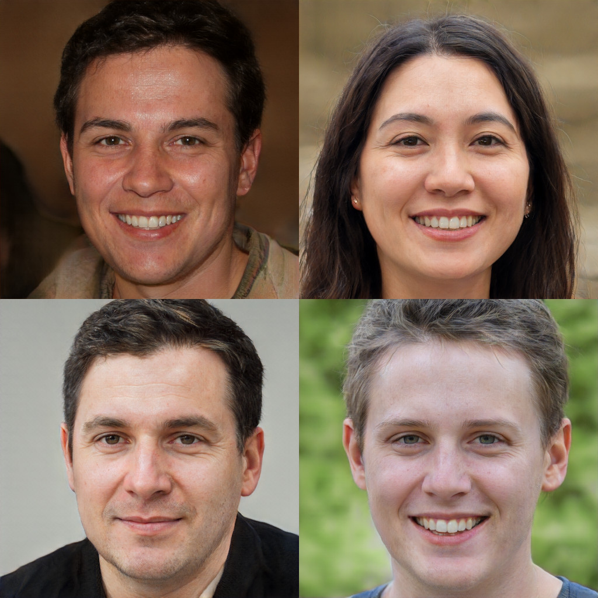

## MobileStyleGAN: A Lightweight Convolutional Neural Network for High-Fidelity Image Synthesis

Official PyTorch Implementation

<p align="center">
  
</p>

For more details, please refer to the [paper](https://arxiv.org/abs/2104.04767).

## Requirements

* Python 3.8+
* 1–8 high-end NVIDIA GPUs with at least 12 GB of memory. We have done all testing and development using DL Workstation with 4x2080Ti

## Training

```bash
pip install -r requirements.txt
python train.py --cfg configs/mobile_stylegan_ffhq.json --gpus <n_gpus>
```

## Generate images using MobileStyleGAN

```bash
python generate.py --cfg configs/mobile_stylegan_ffhq.json --ckpt <path_to_ckpt> --output-path <path_to_store_imgs> --batch-size <batch_size> --n-batches <n_batches>
```

## Pretrained models

|Name|FID|
|:---|:--|
|[mobilestylegan_ffhq.ckpt](https://drive.google.com/file/d/1e4A6chzcKeVaRTU77Rq32Bw1UbY9w_q2/view?usp=sharing)|12.38|

